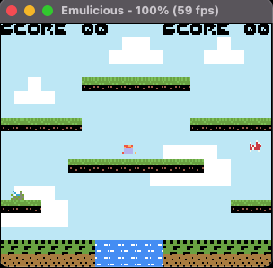
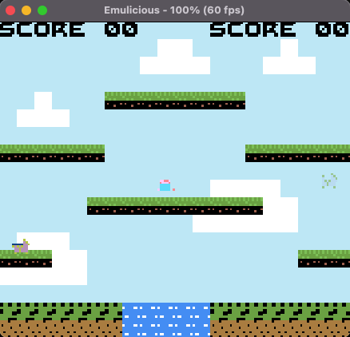

# Lezione 10 - Salto

La prossima meccanica che andiamo ad implementare è quella del salto e lo facciamo inserendo la chiamata alla subroutine *try_jump* prima di eseguire *try_move_left* nel file player

---
*file: utils/player.asm*
```
update_player_position:
    ; Inizializziamo ad ogni iterazione lo stato ad idle, se non dovesse essere corretto
    ; sarebbe sovrascritto dalle istruzioni che seguono
    ld b , %00011100                    ; mascheriamo tutti gli stati 
    ld a, [player_state]                ; tranne salto, caduta, e 'in acqua'
    and b                               ;
    ld [player_state], a                ;
    
    call try_move_left
    call try_move_right
    call try_jump
    
    ld a, [player_state]                ;
    ld b, %00000100                     ;  Se il giocatore sta saltando 
    and b                               ;  Non applichiamo la gravità
    jp nz, .end_update_player_position  ;  
    call try_apply_gravity              ;
    .end_update_player_position         ;
    ret


try_jump:
    ld a, [buttons]              ; Se il tasto A è stato appena premuto 
    bit 4, a                     ; significa che non è in holding
    jr z, .holding               ; 
    xor a                        ; Resettiamo holding_jump a zero
    ld [holding_jump], a         ;
    .holding
    
    ld a, [player_state]         ;
    bit 2, a                     ; Se siamo nello stato jumping 
    jp nz, .jumping              ; continuiamo a salire
                                 ;
    ld a, [buttons]              ; Se il tasto viene premuto mentre siamo in aria
    bit 4, a                     ; non rieseguamo il codice per il salto
    jr nz, .not_jumping          ;
    ld b, $0                     ; 
    ld a, [holding_jump]         ; 
    or b                         ; Se il tasto premuto è ancora quello del loop precedente
    jr nz, .not_jumping          ; non saltiamo
    ld a, $1
    ld [holding_jump], a         ; Siamo nel caso in cui il tasto è stato premuto per la prima
    ld a, %00001000              ; volta mentre il giocatore è a terra
    ld b, a                      ;
    ld a, [player_state]         ;
    and b                        ; Se il player è nello stato falling, infine, 
    jr nz, .not_jumping          ; non rieseguiamo il salto

    ; JUMP
    .jumping 
    ld a, %00000100              ; Settiamo il player state in jumping
    ld [player_state], a         ; in modo da far disegnare la nuova animazione e per i controlli visti in 
                                 ; precedenza
    ld a, [main_player_y]
    sub a, 16+1                  ; the sprite y is not aligned with tile position (0, 0), removing 16 bit removes
                                 ; this difference
    ld c, a                      ; 
    ld a, [main_player_x]        ; Calcoliamo il delta per controllare in quale tile 
    sub a, 8                     ; Andrebbe a finire il player
    ld b, a                      ;
    call get_tile_by_pixel       ; Ritorna il tile della posizione in cui si trova il player in HL
    ld a, [hl]                   ; carichiamo hl in a
    call is_wall_tile            ; Controlliamo se il tile è un muro
    jr nz, .start_falling        ; Se il tile è un muro abbiamo toccato un blocco in alto, iniziamo la caduta
    ld a, [state_jmp_count]      ; Controlliamo da quanti frame stiamo saltando
    ld b, $8                     ; per determinare a che velocità andare
    cp b                         ;
    jr c, .up_by_three           ;
    .up_by_one                   ;
    ld bc, oam_buffer_player_y
    ld a, [bc]                   ;
    sub a, 1                     ; Il player andrà a velocità 3 inizialmente
    ld [bc], a                   ; Per poi rallentare prima di iniziare la discesa
    jp .__up_by                  ; Salendo soltanto quindi di 2
    .up_by_three                 ;
    ld bc, oam_buffer_player_y   ;
    ld a, [bc]                   ;
    sub a, 3                     ; Spostiamo il player di 3 verso l'alto
    ld [bc], a                   ;
    .__up_by
    ld a, [state_jmp_count]      ; Incrementiamo il numero di frame del salto
    add a, 1                     ;
    ld [state_jmp_count], a      ;
    ld a, [jp_max_count]         ; Quando arriviamo a jp_max_count
    ld b, a                      ; Iniziamo la discesa (start_falling)
    ld a, [state_jmp_count]      ;
    cp a, b                      ;
    jr z, .start_falling         ;
    jp .no_up                    ;
    .start_falling               ;
    ld a, $1                     ; Resettiamo state_jmp_count a 1
    ld [state_jmp_count], a      ;
    ld a, %00001000              ; Modifichiamo a jumping il player_state
    ld [player_state], a         ;
    .no_up                       ;
    .not_jumping          
    call reset_positions
    ret     

```
---

La subroutine appena definita permette al player di saltare alla pressione del tasto A.
Se provassimo a compilare ed eseguire il codice in questo momento, noteremmo che, dopo aver effettuato un salto, il player resta bloccato nell'animazione *falling*.

```
# cd /<directory_del_progetto/feli/
# ./run_program.<estensione>
# java -jar Emulicius/Emulicius.jar feli.gbc
```

<div align="center">
  
</div>


Aggiorniamo quindi la routine *try_apply_gravity* modificando lo stato del player da falling a idle ogni volta che questo tocca terra e aggiorniamo la velocità con cui il giocatore scende verso il terreno al passare dei frame.

---
*file: utils/player.asm*
```
try_apply_gravity:
    ld a, [falling_speed]               ; Carico falling_speed in a
    ld b, $12                           ; Carico $12 in b
    cp a, b                             ; a - $12
    jr c, .fall_slow                    ; 12 > di a? se si, esegui il codice fall_slow (Scendi lentamente)
    .fall_fast                          ; Altrimenti scendi velocemente
    
    ld a, [main_player_y]               ; carico la posizione y del giocatore in a
    add a, 4                            ; 
    sub a, 16-2                         ;
    ld c, a                             ; salvo la y in c
    ld a, [main_player_x]               ; carico la posizione x del giocatore in a
    sub a, 8                            ;
    ld b, a                             ; salvo la x in b
    call get_tile_by_pixel              ; Controllo la tile dove andrebbe a finire il player (risultato in hl)
    ld a, [hl]                          ; 
    call is_wall_tile                   ; è un muro ?
    jr nz, .no_down                     ; se si, non applicare la logica per far scendere il player
    ld bc, oam_buffer_player_y          ; 
    ld a, [bc]                          ;
    add a, $2                           ; Applico la gravita (fast quindi 2)
    ld [bc], a                          ;
    jp .__fall_by                       ;
    .fall_slow                          ; FALL SLOW Uguale a fall fast, ma con gravità piu lenta
    
    ld a, [main_player_y]
    add a, 4 
    sub a, 16-1 
    ld c, a
    ld a, [main_player_x]
    sub a, 8
    ld b, a
    call get_tile_by_pixel ; Returns tile address in hl
    ld a, [hl]
    call is_wall_tile
    jr nz, .no_down 
    ld bc, oam_buffer_player_y
    ld a, [bc]
    add a, $1                            ; Applico la gravità (slow quindi 1)
    ld [bc], a
    ld a, [falling_speed]
    add 1
    ld [falling_speed], a
    .__fall_by

    ld a, %00001000                       ; Se abbiamo applicato la gravità
    ld [player_state], a                  ; player state va settato a falling
    ret  ; end_update_player_position     ; e ritorniamo dalla subroutine
    .no_down                            
    ld a, $1                              ; Se non siamo scesi non stiamo piu cadendo, mascheriamo il bit falling
    ld [falling_speed], a                 ; resetto falling speed a 1
    ld b , %11110111                      ; mask per resettare falling bit
    ld a, [player_state]                  ; prendo il player state 
    and b                                 ; lo metto in and con b
    ld [player_state], a                  ; e lo ricarico in player state mascherando il bit falling
    ret
```
---

Andiamo a compilare ed eseguire il nostro codice per poter testare il salto del personaggio e le sue nuove animaizoni. é possibile notare che dopo aver effettuato un salto adesso il giocatore resetta correttamente l'animazione su idle.

```
# cd /<directory_del_progetto/feli/
# ./run_program.<estensione>
# java -jar Emulicius/Emulicius.jar feli.gbc
```

Output lezione 10:
<div align="center">
  
</div>