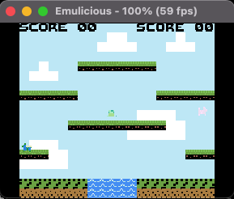
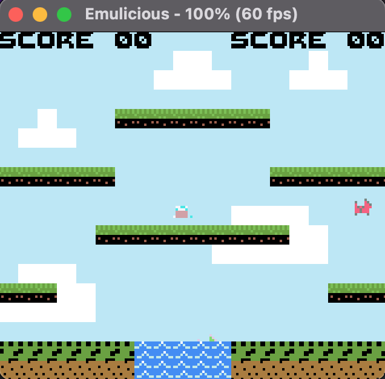

# Lezione 11 - Animazioni player 1

In questo capitolo completeremo tutte quante le animazioni del player uno.
Al momento quando andiamo verso sinistra, lo sprite continua ad essere rivolto verso destra. Per correggere questo comportamento non è necessario disegnarlo nell'altra posizione poiché tra i bit degli attributi di ogni sprite ne esiste uno che si chiama *xflip* che permette di disegnare a specchio il personaggio sull'asse delle x.
Inoltre, quando il giocatore si muove, dobbiamo aggiungergli lo stato running in modo da disegnare lo sprite che corre.

Modifichiamo quindi la subroutine *try_move_left*

---
*file: utils/player.asm*
```
try_move_left:
    ld a, [buttons]                   ; carico lo stato dei bottoni nell’accumulatore
    bit 1, a                          ; testo il bit 1 (Dpad a sinistra) 
    jr nz, .no_left                   ; se il valore non è zero il tasto non è stato
    ld b, %00000010                   ; bit per il player state running in b
    ld a, [player_state]              ; carico il player state in a
    or b                              ; aggiungo il bit running al player state
    ld [player_state], a              ; lo ricarico in a
    ; set x flip to 0
    ld a, %00100000                   ; Set del bit xflip
    ld [oam_buffer_player_attrs], a   ; lo inserisco nel byte degli attributi
    ld a, [main_player_y]             ; le coordinate x e y trovate sono un delta che 
    add a, 4                          ; non viene applicato ancora, utilizzato solo per
    sub a, 16                         ; controllare se ci sono collisioni
    ld c, a                           ; Salvo delta y nel registro c
    ld a, [main_player_x]
    sub a, 8+1
    ld b, a                           ; Salvo delta x nel registro b
    call get_tile_by_pixel            ; controllo in quale tile finirebbe il personaggio
    ld a, [hl]                        ; sposto l’output delle subroutine in a
    call is_wall_tile                 ; controllo se quel tile è attraversabile
    jr nz, .no_left                   ; se in a viene salvato zero, non è 
                                      ; attraversabile, salto a .no_left
    ld bc, oam_buffer_player_x
    ld a, [bc]                        ; Aggiorno la posizione perché non ci son state 
    sub a, 1
    ld [bc], a
    .no_left
    call reset_positions
    ret
```
---

Adesso se premiamo l'input del dpad a sinistra il player uno si rivolgerà nella giusta direzione e inizierà a correre.

<div align="center">
  
</div>

Analogamente in *try_move_right* resettiamo il bit dell'attributo *xflip* quando andiamo a destra e modificato anche *player_state* in running

---
*file: utils/player.asm*
```
; vedi commenti try_move_left
try_move_right:
    ld a, [buttons]
    bit 0, a
    jr nz, .no_right
    ; set player animation to running
    ld b, %00000010
    ld a, [player_state]
    or b
    ld [player_state], a
    ; set x flip to 0
    ld a, %00000000
    ld [oam_buffer_player_attrs], a
    ld a, [main_player_y]
    add a, 4  ; don t check collision from the top left of the sprite, but from a more mid position
    sub a, 16 ; the sprite y is not aligned with tile position (0, 0), removing 16 bit removes this difference
    ld c, a
    ld a, [main_player_x]
    add a, 4 ; dont start checking from the top left
    sub a, 8-4
    ld b, a
    call get_tile_by_pixel ; Returns tile address in hl
    ld a, [hl]
    call is_wall_tile
    jr nz, .no_right
    ; No collision, update position
    ld bc, oam_buffer_player_x
    ld a, [bc]
    add a, 1
    ld [bc], a
    .no_right
    call reset_positions
    ret
```
---

Compiliamo ed eseguiamo il codice per verificare che i movimenti siano corretti anche quando corriamo verso destra.

```
# cd /<directory_del_progetto/feli/
# ./run_program.<estensione>
# java -jar Emulicius/Emulicius.jar feli.gbc
```

Gestiamo adesso le animazioni del personaggio in contatto con l'acqua.
Per farlo, setteremo il bit del *player_state* in underwater quando nel metodo *is_wall_tile* ci accorgiamo che il valore del tile dove si trova il player è $2. Ricordiamo che nella mappa di collisioni per le tile dell'acqua abbiamo impostato il bit a $2.
Lo stato underwater lo gestiremo in *update_player_position*

---
*file: utils/player.asm*
```
is_wall_tile:
    cp a, $02                ; Controlliamo se in a c'è il valore $02
    jr nz, .not_water_tile   ; Se cosi non fosse non è una tile con l'acqua
    ld a, %00010000          ; Se è una tile con l'acqua settiamo il bit 4 a 1
    ld [player_state], a     ; e lo carichiamo in player_state
    ret
    .not_water_tile
    or a, $00              
    ret
```

*file: utils/player.asm*
```
update_player_position:
    ld b , %00011100 
    ld a, [player_state]
    and b 
    ld [player_state], a

    ld a, [player_state]            ; Carico player_state in a
    bit 4, a                        ; Controllo se il bit 4 è settato
    jr z, .not_underwater           ; se non è settato non siamo sott'acqua
    ld a, $8d                       ; Carico $8d in a 
    ld [oam_buffer_player_y], a     ; lo inserisco nella y del player ($8d è una altezza che 
                                    ; assegnamo al player in modo da far uscire solo la sua testa 
                                    ; dall'acqua) 
    .less_then_d                    ;
    call try_jump                   ; quando siamo sott'acqua
    call try_move_left              ; possiamo avere solo questi tre
    call try_move_right             ; movimenti abilitati

    jp .end_update_player_position
    .not_underwater
    
    call try_move_left
    call try_move_right
    call try_jump
    
    ld a, [player_state]                
    ld b, %00000100                     
    and b                                 
    jp nz, .end_update_player_position  

    

    call try_apply_gravity

    .end_update_player_position
    ret
```

---

Adesso il nostro giocatore interagisce con l'acqua correttamente

```
# cd /<directory_del_progetto/feli/
# ./run_program.<estensione>
# java -jar Emulicius/Emulicius.jar feli.gbc
```

Output lezione 11:
<div align="center">
  
</div>
