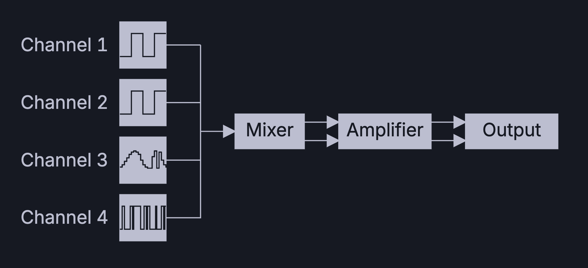

# Lezione 15 - Audio
Il gioco arrivati a questo punto risulta essere quasi completo, ma manca una componente fondamentale, ovvero quella dell'audio.
Nel Game Boy l'audio è composto dalla seguente architettura 

<div align="center">
  
</div>

Ci sono quattro unità adibite alla generazione del suono, chiamati canale 1, 2, 3 e 4.
Ogni canale è specializzato in una diversa tipologia di segnale elettrico:
* Canale 1 e 2 Producono un impulso, con quattro lunghezze possibili
* Canale 3 produce onde che possono essere personalizzate dal programmatore
* Canale 4 detto canale del rumore, produce onde pseudo-randomiche

I registri dell'audio seguono la seguente convenzione: NRxy 
dove la x è il numero del canale e y è l'id del registro all'interno di quel canale.

Per ognuno dei quattro canali abbiamo:
* *NRx0* Solitamente una caratteristica specifica del canale
* *NRx1* Controlla la lunghezza del timer
* *NRx2* Controlla il volume
* *NRx3* Controlla il periodo
* *NRx4* è il trigger del canale

## Registri globali

Dei registri globali descriveremo solo quelli utilizzati, non tutto l'hardware a disposizione è stato utilizzato per lo scopo di questo gioco

## NR52 - Registro Audio master

<div align="center">
  
</div>

* *Bit 7* Audio on/off Permette di tenere attivo o meno l'audio
* *Bit 0, 1, 2, 3* Permettono di attivare i canali 1, 2, 3 e 4


Partiamo aggiungendo nel main  l'inizializzazione dell'audio e l’aggiornamento delle note nel main loop. Includiamo inoltre il file sound che conterrà l'implementazione delle routine sopra citate.

---
*file: main.asm*
```
INCLUDE "utils/sound.asm"
```

*file: main.asm*
```
call init_audio
.main_loop:
    call get_buttons_state
    halt
    nop
    call water_animation
    call update_player_position
    call update_player2_position
    call player_animation
    call player_2_animation
    call player_got_food
    cp a, $ff    ; Se viene ritornato $FF il player 1 ha vinto
    jp z, Start  ; Resettiamo il gioco
    call player2_got_food
    cp a, $ff    ; Se viene ritornato $FF il player 2 ha vinto
    jp z, Start  ; Resettiamo il gioco
    call food_position_handler
    call $ff80
    call update_audio
    jp .main_loop

```

*file: utils/sound.asm*
```
turn_off_sound:
    ld a, %0000000        ;
    ; Shut sound down
    ld [rNR52], a         ; Settando a 0 rNR52 possiamo rimuovere l'audio
    ret                   ;


; Subroutine utilizzata per inizializzare i registri audio
init_audio:
    xor a                                       ;  poniamo a = 0
    ;ld [pres_screen_sound_counter], a           ;  pres_screen_sound_counter = 0
    ld [note_tick], a                           ;  note_tick = 0
    ld [sound_length], a                        ;  sound_length = 0
    ld [sound_pointer], a                       ;  sound_pointer = 0
    ld a, AUDENA_ON                             ;  a = AUDENA_ON
    ld [rNR52], a                               ;  Audio attivato
    ld a, %00111000                             ;  volume iniziale settato 
    ld [rNR12], a          ;                    ;  su medio
    ld a, %10000000                             ;  canale 1 abilitato
    ld [rNR14], a                               ;
    ld a, %01000010                             ; duty cycle 50% 
    ld [rNR21], a                               ;
    ld a, %00110000                             ; volume massimo per canale 2
    ld [rNR22], a                               ;
    ld a, %11000000        
    ld [rNR24], a
    ret


; Questo metodo aggiungera l'indirizzo base di sound_melody alla nota corrente di sound_pointer
; of sound pointer
; @return hl current note
get_current_note:
    ld de, sound_melody             ;
    ld a, [sound_pointer]           ;  Aggiungi l'offset sound_pointer a sound_melody
    add a, e                        ;

    ld e, a 
    jr nc, .no_carry_current_note   ; 
    ld a, d                         ; Controlla se c'è un carry dopo l'addizione
    add a, $1                       ;
    ld d, a                         ;
    .no_carry_current_note
    ld a, [de]                      ;
    ld l, a                         ; salva il valore in hl
    inc de                          ; 
    ld a, [de]                      ;
    ld h, a                         ; 
    ret 


; @param hl l'indirizzo base di una melodia
; @return in l the length of the current note
get_current_sound_length:
    xor a                           ; 
    ld d, a                         ; Ogni indirizzo all'interno di una melodia conterrà
    ld e, a                         ; 
    ld a, $2                        ; 0) 1 byte H nota, 1) 1 byte L nota, 2) 1 byte lunghezza nota
    ld e, a                         ;
    add hl, de                      ; spostiamoci di 2 per ottenere la lunghezza della nota
    ld a, [sound_pointer]           ;
    add a, l                        ; L'indirizzo base dipende dalla variabile sound_pointer
    ld l, a                         ; lo aggiungiamo ad HL per arrivare alla nostra nota corrente
    jr nc, .no_carry_sound_pointer  ; 
    ld a, h                         ;
    add a, $1                       ;
    ld h, a                         ;
    .no_carry_sound_pointer

    ld a, [hl]                      ; ritorna in l la lunghezza della nota corrente
    ld l, a                         ; 
    ret


update_audio:
    ld a, [note_tick]                    ;
    or a, %00000000                      ;  se note_tick è zero, facciamo partire il nuovo suono
    jr z, .play_new_note                 ;  

    ld hl, sound_melody
    call get_current_sound_length        ; Inseriamo in l il sound length
    ld a, [note_tick]                    ; Otteniamo il numero di cicli che attenderemo 
    cp a, l                              ; Controlliamo se son passati tutti
    jr nz, .end_update_note_tick         ; Se non son passati tutti, continua a suonare lo stesso 
                                         ; suono

    ld a, [sound_pointer]                ;
    add a, $4                            ; Se il risultato del cp precedente è zero, passiamo alla 
                                         ; prossima nota
    ld [sound_pointer], a                ; spostiamo sound pointer di 4 (Prossima nota)
    xor a                                ; 
    ld [note_tick], a                    ; Resettiamo note_tick
    ld a, [sound_pointer]                ;
    ld b, a                              ; se sound pointer è lo stesso di sound_melody_n_of_notes
                                         ; ripartiamo dall'inizio
    ld a, [sound_melody_n_of_notes]      ;  
    cp a, b                              ;
    jr nz, .end_update_audio             ; Se invece non è zero, continuiamo con la melodia
    xor a                                ;
    ld [sound_pointer], a                ;
    jp .end_update_audio                 ;
    .play_new_note                       ; NUOVA NOTA
    call get_current_note                ; Inseriamo la nuova nota in hl
    ld a, l                              ;
    ld [rNR13], a                        ; Inseriamo la parte bassa in rNR13
    ld a, h
    ld [rNR14], a                        ; Inseriamo la parte alta in rNR14
    .end_update_note_tick
    ld a, [note_tick]                    ;
    inc a                                ;  Incrementiamo note_tick
    ld [note_tick], a                    ;  aggiorniamolo
    .end_update_audio
    ret


 jump_sound:
    ld hl, G2
    ld a, l
    ld [rNR23], a         ; Load lower part to 13
    ld a, h
    or a, %11000000       ; bit 7 - Channel enabled. 
    ld [rNR24], a         ; bit 6 - Period enabled (Or the sound will play forever). Period depends on nr21
    inc hl
    ret


eat_food_sound:
    ld hl, $06fa
    ld a, l
    ld [rNR23], a         ; Load lower part to 13
    ld a, h
    or a, %11000000       ; bit 7 - Channel enabled. 
    ld [rNR24], a         ; bit 6 - Period enabled (Or the sound will play forever). Period depends on nr21
    inc hl
    ret

```
---

Inseriamo le varibili utilizzate nel codice precedente nella WRAM all'interno della sezione *Player_state*

---
*file: utils/wram.asm*
```
note_tick: ds 1
sound_pointer: ds 2
current_note: ds 2
current_note_length: ds 2

; sezione Counter
; Lista delle note
def C0 EQU 44
def Cd0 EQU 156
def D0 EQU 262
def Dd0 EQU 363
def E0 EQU 457
def F0 EQU 547
def Fd0 EQU 631
def G0 EQU 710
def Gd0 EQU 786
def A0 EQU 854
def Ad0 EQU 923
def B0 EQU 986
def C1 EQU 1046
def Cd1 EQU 1102
def D1 EQU 1155
def Dd1 EQU 1205
def E1 EQU 1253
def F1 EQU 1297
def Fd1 EQU 1339
def G1 EQU 1379
def Gd1 EQU 1417
def A1 EQU 1452
def Ad1 EQU 1486
def B1 EQU 1517
def C2 EQU 1546
def Cd2 EQU 1575
def D2 EQU 1602 
def Dd2 EQU 1627
def E2 EQU 1650
def F2 EQU 1673
def Fd2 EQU 1694
def G2 EQU 1714
def Gd2 EQU 1732
def A2 EQU 1767
def B2 EQU 1783
def C3 EQU 1798
def Cd3 EQU 1812
def D3 EQU 1825
def Dd3 EQU 1837
def E3 EQU 1849
def F3 EQU 1860
def Fd3 EQU 1871
def G3 EQU 1881
def Gd3 EQU 1890
def A3 EQU 1899
def Ad3 EQU 1907
def B3 EQU 1915
def C4 EQU 1923
def Cd4 EQU 1930
def D4 EQU 1936
def Dd4 EQU 1943
def E4 EQU 1949
def F4 EQU 1954
def Fd4 EQU 1959
def G4 EQU 1964
def Gd4 EQU 1969
def A4 EQU 1974
def Ad4 EQU 1978
def B4 EQU 1982
def C5 EQU 1985
def Cd5 EQU 1988
def D5 EQU 1992
def Dd5 EQU 1995
def E5 EQU 1998
def F5 EQU 2001
def Fd5 EQU 2004
def G5 EQU 2009
def A5 EQU 2011
def Ad5 EQU 2013 
def B5 EQU 2015
def FREQ4 EQU 1627
def FREQ5 EQU 1627
def NO_SOUND EQU $0fff
```
---
Inseriamo nella ROM le costanti

---
*file: utils/rom.asm*
```
sound_melody_n_of_notes: db 51 * 4    ; il n delle note x 4. Ogni campo contiene 4 byte (2 word)
sound_melody:
dw A3, 08 
dw A3, 08
dw A3, 08
dw A3, 08
dw G3, 08
dw F3, 08
dw E3, 08
dw F3, 08
dw G3, 08
dw A3, 08
dw A3, 08
dw A3, 08
dw A3, 08
dw C4, 08
dw A3, 08
dw A3, 08
dw F3, 08
dw E3, 08
dw D3, 08
dw A3, 08
dw G3, 08
dw A3, 08
dw A3, 08
dw G3, 08
dw F3, 08
dw G3, 08
dw A3, 08
dw A3, 08
dw C4, 08
dw A3, 08
dw A3, 08
dw G3, 08
dw F3, 08
dw D3, 08
dw F3, 08
dw D3, 08
dw F3, 08
dw D3, 08
dw F3, 08
dw D3, 08
dw E3, 08
dw F3, 08
dw E3, 08
dw F3, 08
dw G3, 08
dw A3, 08
dw G3, 08
dw A3, 08
dw A3, 08
dw C4, 08
dw D4, 08

pres_screen_n_of_notes: db 18 * 4    ; il n delle note x 4. Ogni campo contiene 4 byte (2 word)
; same length as sound_melody
sound_melody_pres_screen:
dw D2, $06
dw B2, $10
dw D2, $10
dw G2, $10
dw D2, $10
dw A2, $10
dw C2, $10
dw F2, $10
dw G2, $06
dw D2, $10
dw B2, $10
dw D2, $10
dw G2, $06
dw D2, $10
dw A2, $10
dw C2, $10
dw F2, $10
dw NO_SOUND,$20 

```
---

Se tutti i passaggi sono stati riportati correttamente dovremmo poter ascoltare l'audio prodotto dal codice di questo capitolo

```
# cd /<directory_del_progetto/feli/
# ./run_program.<estensione>
# java -jar Emulicius/Emulicius.jar feli.gbc
```
