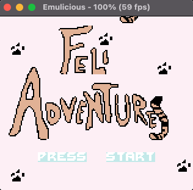

# Lezione 16 - Pres screen

Il nostro gioco è ormai completamente giocabile, ma manca una componente fondamentale, la schermata con la presentazione che ci chiede di premere il tasto start per iniziare la pratita.

Subito dopo l'operazione di pulizia della memoria inseriamo il seguente codice, per poi ripulire ancora la memoria prima di cominciare ad importare i nostri asset nella VRAM

---
*file: main.asm*
```
ld hl, $8000          ;  
ld de, $9fff          ;  
call clear_mem_area   ;

ld hl, $fe00          ;  
ld de, $fe9f          ;  
call clear_mem_area   ;

ld a, %00000001       ;  
ld [rVBK], a          ;
ld hl, $8000          ;  
ld de, $9fff          ;
call clear_mem_area   ; 

xor a                 ;  
ld [rVBK], a          ;

ld hl, $C000          ;
ld de, $DFFF          ;  
call clear_mem_area   ;

; PRESENTATION SCREEN
call init_audio                       ; Inizializziamo l'audio
call background_presentation_screen   ; importiamo i binari per il background

ld hl, $9300                    ;
ld bc, __char_bin - char_bin    ; Copiamo i binari dei caratteri nella VRAM
ld de, char_bin                 ;
call copy_data_to_destination   ;
call presentation_screen        ; Facciamo partire il loop del presentation screen
; PRESENTATION SCREEN

ld hl, $8000                    ;  
ld de, $9fff                    ; 
call clear_mem_area             ;

ld a, %00000001                 ;
ld [rVBK], a                    ; 
ld hl, $8000                    ;
ld de, $9fff                    ; 
call clear_mem_area             ;

xor a                           ; 
ld [rVBK], a                    ;

ld hl, $C000                    ; 
ld de, $DFFF                    ;
call clear_mem_area             ;

ld hl, $fe00                    ; 
ld de, $fe9f                    ; 
call clear_mem_area             ;

```

*file: utils/graphics.asm*
```

presentation_screen:
    xor a                                         ;  a = 0
    ld [presentation_screen_flicker_counter], a   ;  presentation_screen_flicker_counter = 0
    ; color writing background
    ld a, %10000000                  ;
    ld hl, palettes                  ; 
    ld bc, __palettes - palettes     ;            Carico le palette per il bg del pres. screen
    call set_palettes_bg             ;
    ld hl, $99c4                     ;
    ld de, P_                        ;
    ld a, [de]                       ;
    ld [hli], a                      ;
    ld de, R_                        ;
    ld a, [de]                       ;
    ld [hli], a                      ;
    ld de, E_                        ;
    ld a, [de]                       ;     Aggiungiamo PRESS START allo schermo
    ld [hli], a                      ;     
    ld de, S_                        ;
    ld a, [de]                       ;
    ld [hli], a                      ;
    ld de, S_                        ;
    ld a, [de]                       ;
    ld [hli], a                      ;
    inc hl                           ;
    inc hl                           ;
    ld de, S_                        ;
    ld a, [de]                       ;
    ld [hli], a                      ;
    ld de, T_                        ;
    ld a, [de]                       ;
    ld [hli], a                      ;
    ld de, A_                        ;
    ld a, [de]                       ;
    ld [hli], a                      ; 
    ld de, R_                        ;
    ld a, [de]                       ;
    ld [hli], a                      ;
    ld de, T_                        ;
    ld a, [de]                       ;
    ld [hli], a                      ;
    

    ld a, %10000011                  ; accendiamo lo schermo
    ld [rLCDC], a                    ;

    ld a, %00000001                  ; Selezioniamo la VRAM bank 1
    ld [rVBK], a                     ;
    .start_loop
    halt
    nop
    ld a, [pres_screen_sound_counter]         ; carico il contatore del pres. screen in a 
    add a, $1                                 ; aggiungo 1
    ld [pres_screen_sound_counter], a         ; aggiorno il contatore
    cp a, $1                                  ; a - 1 =?
    jr nz, .dont_play_note                    ; se non vale zero salto a .dont_play_note
    call pres_screen_audio                    ; altrimenti faccio partire il suono
    xor a                                     ; carico zero in a
    ld [pres_screen_sound_counter], a         ; inserisco zero all'indiriz. puntato dal contatore
    .dont_play_note                                 
    

    ld a, [presentation_screen_flicker_counter]        ;     Ogni 20 iterazioni cambiamo le palette
    add a, $1                                          ;     della label PRESS START
    ld [presentation_screen_flicker_counter], a        ;     
    cp a, $20                                          ;     a - 20 = ?
    jr nc, .black_press_start                          ;     20 <= a -> salta a .black_press_start
    .white_press_start
    ld hl, $99c4                                       ;     carico in hl $99c4 (Indirizzo di P)
    ld a, %00000011                                    ;     assegno la palette 2
    ld [hli], a                                        ;     
    ld [hli], a                                        ;
    ld [hli], a                                        ;     PRESS START per ogni lettera assegno
    ld [hli], a                                        ;     il colore bianco
    ld [hli], a                                        ;
    inc hl                                             ;
    inc hl                                             ;
    ld [hli], a                                        ;
    ld [hli], a                                        ;
    ld [hli], a                                        ;
    ld [hli], a                                        ;
    ld [hli], a                                        ;
    jp .end_presentation_screen_palette_assignation
    .black_press_start
    ld hl, $99c4                                       ;
    ld a, %00000000                                    ;      $99c4 indirizzo di P
    ld [hli], a                                        ;
    ld [hli], a                                        ;      PRESS START per ogni lettera assegno il 
    ld [hli], a                                        ;      colore nero
    ld [hli], a                                        ;
    ld [hli], a                                        ;
    inc hl                                             ;
    inc hl                                             ;
    ld [hli], a                                        ;
    ld [hli], a                                        ;
    ld [hli], a                                        ;
    ld [hli], a                                        ;
    ld [hli], a                                        ;
    .end_presentation_screen_palette_assignation
    ld a, [presentation_screen_flicker_counter]        ;
    cp a, $30                                          ;   Quando pres_screen_flicker_counter è 30, 
    jr nz, .dont_reset_counter                         ;   resettiamolo a  0.
    xor a                                              ;
    ld [presentation_screen_flicker_counter], a        ;
    .dont_reset_counter

    call get_buttons_state                             ;
    ld a, [buttons]                                    ; 
    bit 7, a                                           ; il tasto start è stato premuto?
    jr nz, .start_loop                                 ; no = ripeti il ciclo
    ld a, %00000000          ; set vram bank to 0      ; 
    ld [rVBK], a             ;                         ;


    ld hl, $5FFF                                       ;
    .bwait                                             ;
    dec HL                                             ;  Busy wait for some instants
    ld a, h                                            ;  fter the user has press start button before
    or l                                               ;  starting the game
    jr nz, .bwait                                      ;

    ; turn off the screen again and wait some seconds
    xor a
    ld [rLCDC], a                                      ; Rispegnamo lo schermo
    ret


; Routine implementata per importare i tile del presentation screen
background_presentation_screen:
    ld hl, $8800
    ld bc, __adventures_pres_screen - adventures_pres_screen
    ld de, adventures_pres_screen
    call copy_data_to_destination

    ld bc, __adventures_pres_screen_tile_map - adventures_pres_screen_tile_map
    ld hl, $9880
    ld de, adventures_pres_screen_tile_map
    call copy_data_to_destination

    ld hl, $8d40
    ld bc, __feli_pres_screen - feli_pres_screen
    ld de, feli_pres_screen
    call copy_data_to_destination

    ld bc, __feli_pres_screen_tile_map - feli_pres_screen_tile_map
    ld hl, $9800
    ld de, feli_pres_screen_tile_map
    call copy_data_to_destination

    ret
```
---

Nel file sound inseriamo la logica per l'audio del presentation screen

---
*file: utils/sound.asm*
```
; This method will add to the base address of sound_melody_pres_screen the current value
; of sound pointer
; @return hl current note
get_current_note_pres_screen:
    ld de, sound_melody_pres_screen             ;
    ld a, [sound_pointer]           ; Add to sound melody the offset sound_pointer
    add a, e                        ;

    ld e, a 
    jr nc, .no_carry_current_noteps ; 
    ld a, d                         ; check if there is a carry after the addition
    add a, $1                       ;
    ld d, a                         ;
    .no_carry_current_noteps
    ld a, [de]                      ;
    ld l, a                         ; Load the value in hl
    inc de                          ; 
    ld a, [de]                      ;
    ld h, a                         ; 
    ret 


 pres_screen_audio:
    ld a, [note_tick]                    ;
    or a, %00000000                      ;  If the note tick is on zero it means that we are going to play
    jr z, .play_new_noteps               ;  a new note

    ld hl, sound_melody_pres_screen
    call get_current_sound_length        ; put sound length in l
    ld a, [note_tick]                    ; get the number of ticks 
    cp a, l                              ; check if all ticks have been played
    jr nz, .end_update_note_tickps       ; if not, keep playing the same sound 

    ld a, [sound_pointer]                ;
    add a, $4                            ; if the result of the previous cp is zero, it means that we have to move
    ld [sound_pointer], a                ; the sound_pointer to the next note
    xor a                                ; and we need to reset note_tick to zero in order
    ld [note_tick], a                    ; to play the new sound.
    ld a, [sound_pointer]                ;
    ld b, a                              ;  if sound pointer is the same length as sound_length, reset it 
    ld a, [pres_screen_n_of_notes]       ;  to zero and start the melody from the beginning
    cp a, b                              ;
    jr nz, .end_update_audiops           ;
    xor a                                ;
    ld [sound_pointer], a                ;
    jp .end_update_audiops

    .play_new_noteps
    call get_current_note_pres_screen ; current note will be put in hl
    ld a, l
    ld [rNR13], a   ; Load lower part to 13
    ld a, h
    ld [rNR14], a   ; Load High bit to 14
    .end_update_note_tickps
    ld a, [note_tick]                    ;
    inc a                                ;  Note tick will tell us how many cycles the note has been
    ld [note_tick], a                    ;  playing. if it is zero we are on a new note and we should just
    .end_update_audiops
    ret
```
---

Aggiungiamo nella ROM le costanti e i binari necessari

---
*file: utils/rom.asm*
```
SECTION "textures_2", ROMX[$4000]
adventures_pres_screen:
    INCBIN "backgrounds/adventures_pres_screen"
__adventures_pres_screen:
adventures_pres_screen_tile_map:
    INCBIN "backgrounds/adventures_pres_screen_tilemap"
__adventures_pres_screen_tile_map:
feli_pres_screen:
    INCBIN "backgrounds/feli_pres_screen"
__feli_pres_screen:
feli_pres_screen_tile_map:
    INCBIN "backgrounds/feli_pres_screen_tilemap"
__feli_pres_screen_tile_map:
```
---

Aggiungiamo nella WRAM le variabili utilizzate nel codice precedente

---
*file: utils/wram.asm*
```
pres_screen_sound_counter: ds 1
```
---

Compiliamo ed eseguiamo il codice per poter visualizzare il presentation screen

---
```
# cd /<directory_del_progetto/feli/
# ./run_program.<estensione>
# java -jar Emulicius/Emulicius.jar feli.gbc
```

<div align="center">
  
</div>

---

Aggiungiamo il suono per ogni volta in cui il giocatore uno o il giocatore due ottengono la risorsa

---
*file: utils/player.asm*
```
...subito dopo call joy_animation...
call eat_food_sound 

...subito dopo jumping...
call jump_sound
```

*file: utils/player2.asm*
```
...subito dopo call call spawn_food...
call eat_food_sound 

...subito dopo .jump...
call jump_sound
```
