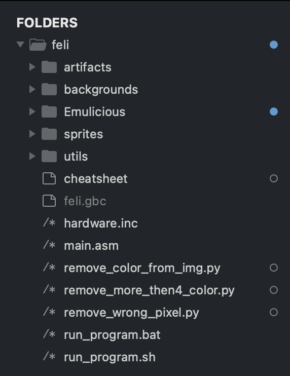
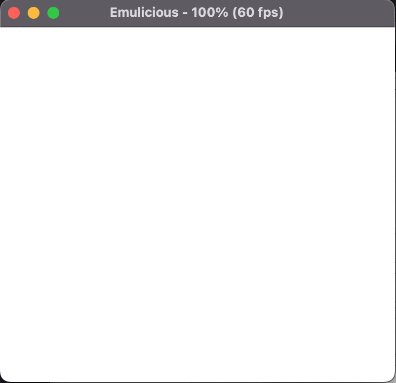

# Lezione 1 - Prerequisiti
Per poter sviluppare un gioco per Game Boy Color avremo bisogno di alcuni strumenti
*	RGBDS il nostro assembler
*	Emulatore Utilzzato per testare il nostro gioco
*	Un IDE o un editor di testo per scrivere il nostro codice

## 1.1 Struttura del progetto
Prima di cominciare a programmare definiamo la struttura del nostro progetto, l’immagine che segue mostra l’alberatura scelta



Di seguito una breve descrizione delle varie directory
*	*artifacts* Contiene le rom che produciamo per il nostro progetto
*	*backgrounds* Contiene gli sfondi
*	*Emulicius* Contiene il progetto dell’emulatore che andremo ad utilizzare
*	*Sprites* Contiene tutti gli sprite del progetto
*	*Utils* Contiene tutti i file .asm che includeremo nel main

La cartella utils è fondamentale e contiene molta della logica aggiuntiva che viene inclusa ed utilizzata dal file main.asm, il codice presente all’interno di essi sarà discusso nei prossimi capitoli.
Per ora lasceremo tutte le cartelle vuote, tranne Emulicious che non è altro che il progetto dell'emulatore, backgrounds e sprites.
Includiamo nella root del progetto il file hardware.inc che contiene tutte le costanti che useremo nel progetto e aggiungiamo i due script utilizzati per la compilazione.

```
*file: run_program.sh*

#!/bin/bash

rgbasm -o main.o main.asm

if [[ $? != 0 ]]; then
  echo "Error while compiling rgbasm"
  exit 1
fi
rgblink -o feli.gbc main.o
rgbfix -C -v -p 0 feli.gbc
```
---
```
*file: run_program.bat*

rgbasm -o feli.o main.asm
if %errorlevel% neq 0 exit 1
rgblink -o feli.gbc feli.o
rgbfix -C -v -p 0 feli.gbc
```

## 1.2 Il main loop
Il primo passo è quello di creare il file main.asm nella stessa directory dell’immagine "Alberatura progetto".
Il processore del Game Boy e del Game Boy color iniziano ad eseguire le istruzioni a partire dall’indirizzo di memoria $100, in questa area di memoria c’è abbastanza spazio per eseguire soltanto due comandi, il primo sarà nop (No operation), il secondo un salto all’indirizzo di memoria dove risiede il nostro codice. l’istruzione jp farà in modo che la prossima riga di codice ad essere eseguita sarà quella che corrisponde all’indirizzo di memoria dove risiede la label Start.
Una label non è altro che un’etichetta che dice al compilatore in quale area dell’hardware salvare il codice e da quale indirizzo
```
SECTION "Header", ROM0[$100]
EntryPoint: 
nop 
jp Start ; Leave this tiny space
```
Definiamo una nuova sezione che parte dall’indirizzo di memoria $150 e, come per ogni gioco, definiamo il main loop
```
SECTION "Game code", ROM0[$150]
Start:
.main_loop:
jp .main_loop
```
Adesso che è stato definito lo scheletro di base del nostro codice, possiamo compilarlo e caricare la nostra rom in un emulatore. Al momento non c’è nulla presente sullo schermo, ma questa è la nostra prima rom.
Comandi per compilare il nostro codice:

```
cd /<directory_del_progetto/feli/
./run_program.<estensione>
```

Output ROM: feli.gbc

