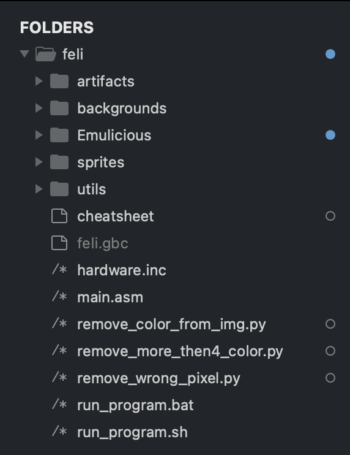

# Lezione 1 - Prerequisiti
Per poter sviluppare un gioco per Game Boy Color avremo bisogno di alcuni strumenti
*	RGBDS il nostro assembler
*	Emulatore Utilzzato per testare il nostro gioco
*	Un IDE o un editor di testo per scrivere il nostro codice

## 1.1 Struttura del progetto
Prima di cominciare a programmare definiamo la struttura del nostro progetto, l’immagine che segue mostra l’alberatura scelta

<div align="center">
  
</div>

Di seguito una breve descrizione delle varie directory
*	*artifacts* Contiene le rom che produciamo per il nostro progetto
*	*backgrounds* Contiene gli sfondi
*	*Emulicius* Contiene il progetto dell’emulatore che andremo ad utilizzare
*	*Sprites* Contiene tutti gli sprite del progetto
*	*Utils* Contiene tutti i file .asm che includeremo nel main

La cartella utils è fondamentale e contiene molta della logica aggiuntiva che viene inclusa ed utilizzata dal file main.asm, il codice presente all’interno di essi sarà discusso nei prossimi capitoli.
Per ora lasceremo tutte le cartelle vuote, tranne Emulicious che non è altro che il progetto dell'emulatore, backgrounds e sprites.
Includiamo nella root del progetto il file hardware.inc che contiene tutte le costanti che useremo nel progetto e aggiungiamo i due script utilizzati per la compilazione.

*file: run_program.sh*
```
#!/bin/bash

rgbasm -o main.o main.asm

if [[ $? != 0 ]]; then
  echo "Error while compiling rgbasm"
  exit 1
fi
rgblink -o feli.gbc main.o
rgbfix -C -v -p 0 feli.gbc
```

---

*file: run_program.bat*
```
rgbasm -o feli.o main.asm
if %errorlevel% neq 0 exit 1
rgblink -o feli.gbc feli.o
rgbfix -C -v -p 0 feli.gbc
```

## 1.2 Il main loop
Il primo passo è quello di creare il file main.asm nella stessa directory dell’immagine "Alberatura progetto".
Il processore del Game Boy e del Game Boy color iniziano ad eseguire le istruzioni a partire dall’indirizzo di memoria $100, in questa area di memoria c’è abbastanza spazio per eseguire soltanto due comandi, il primo sarà nop (No operation), il secondo un salto all’indirizzo di memoria dove risiede il nostro codice. l’istruzione jp farà in modo che la prossima riga di codice ad essere eseguita sarà quella che corrisponde all’indirizzo di memoria dove risiede la label Start.
Una label non è altro che un’etichetta che dice al compilatore in quale area dell’hardware salvare il codice e da quale indirizzo
```
SECTION "Header", ROM0[$100]
EntryPoint: 
nop 
jp Start ; Leave this tiny space
```
Definiamo una nuova sezione che parte dall’indirizzo di memoria $150 e, come per ogni gioco, definiamo il main loop
```
SECTION "Game code", ROM0[$150]
Start:
.main_loop:
jp .main_loop
```

## 1.3 Inizializzazione della memoria

Ogni volta che avviamo la nostra console, le aree di memoria potrebbero essere sporche e non inizializzate a zero, per evitare qualsiasi tipo di comportamento inaspettato durante l’esecuzione del gioco, inizializzeremo tutte le aree di memoria a zero con la seguente subroutine

*file: utils/vram.asm*
```
SECTION "vRAM code", ROM0
; -- Prima di richiamare questo metodo disabilita lo schermo
; -- Questa subroutine pulisce la memoria che parte dall'indirizzo contenuto in hl fino a quello contenuto in de
; -- hl: start
; -- de: end
clear_mem_area:         ; Nome della subroutine
.clear_loop             ; Dichiarazione label .clear_loop
xor a                   ; il registro a (Accumulatore) viene inizializzato a zero
ld [hli], a             ; inserisce il valore di a all’indirizzo di memoria puntato da hl per poi far puntare 
                        ; hl all’indirizzo di memoria successivo (HL Incement)
 
ld a, l                 ; Carica il valore del registro l nel registro a
cp a, e                 ; Viene eseguita l’operazione aritmetica a - e
jp nz, .clear_loop      ; Se il valore non è zero, viene rieseguito il codice a partire da .clear_loop
ld a, h                 ; Carica il valore di h in a 
cp a, d                 ; Viene eseguita l’operazione aritmetica a - d
jp nz, .clear_loop      ; se il valore non è zero si riesegue il codice a partire da .clear_loop
ret                     ; Ritorna dalla subroutine

```

La subroutine è molto semplice: essa non fa altro che impostare a zero tutti gli indirizzi di memoria che vanno dall’ indirizzo contenuto nella coppia di registri hl fino all’indirizzo che si trova nella coppia di registri de. Il codice lo salveremo nella cartella utils, in un file denominato vram.asm. Per includerlo nel nostro programma ci basterà inserire la direttiva INCLUDE come prima istruzione del file main.asm. Includeremo inoltre anche il file hardware.inc che contiene tutte quante le costanti associati agli indirizzi dei registri.
Quando utilizziamo la direttiva INCLUDE tutto il codice presente nel file indicato tra doppi apici viene incluso nel file dove è dichiarato il comando.

*file: main.asm*

```
INCLUDE "utils/vram.asm"
INCLUDE "hardware.inc"
```

L’operazione di pulizia della memoria la verrà effettuata una sola volta, prima di entrare nel loop del gioco, quindi subito dopo la label start.


```
*file: main.asm*

ld hl, $8000                   ; vRAM
ld de, $9fff                   ; dall’indirizzo 0:$8000 a 0:$9fff 
call clear_mem_area            ;
ld hl, $fe00                   ; OAM
ld de, $fe9f                   ; dall’indirizzo 0:$fe00 a 0:$fe9f
call clear_mem_area            ;
                               ;  
ld a, %00000001                ; vRAM bank 1
ld [rVBK], a                   ; Quando in questo registro inseriamo il valore 1, viene impostato il bank 1 
                               ; della vRAM
ld hl, $8000                   ; Impostiamo tutti I valori della 1:$8000 1:$9fff 
ld de, $9fff                   ;
call clear_mem_area            ;  
xor a                          ; Impostiamo tutti I valori della vRAM bank a 0
ld [rVBK], a                   ; 
ld hl, $C000                   ; WRAM
ld de, $DFFF                   ;  dall’indirizzo $C000 to $DFFF
call clear_mem_area            ;
```  

Adesso che è stato definito lo scheletro di base del nostro codice, possiamo compilarlo e caricare la nostra rom in un emulatore. Al momento non c’è nulla presente sullo schermo, ma questa è la nostra prima rom.
Comandi per compilare il nostro codice:

```
cd /<directory_del_progetto/feli/
./run_program.<estensione>
```

<div align="center">
  
</div>
