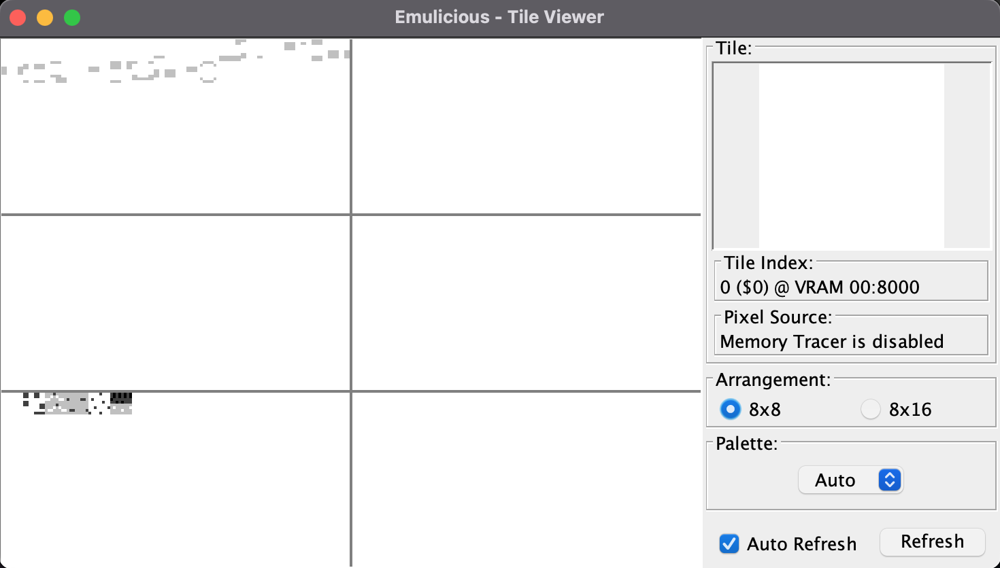
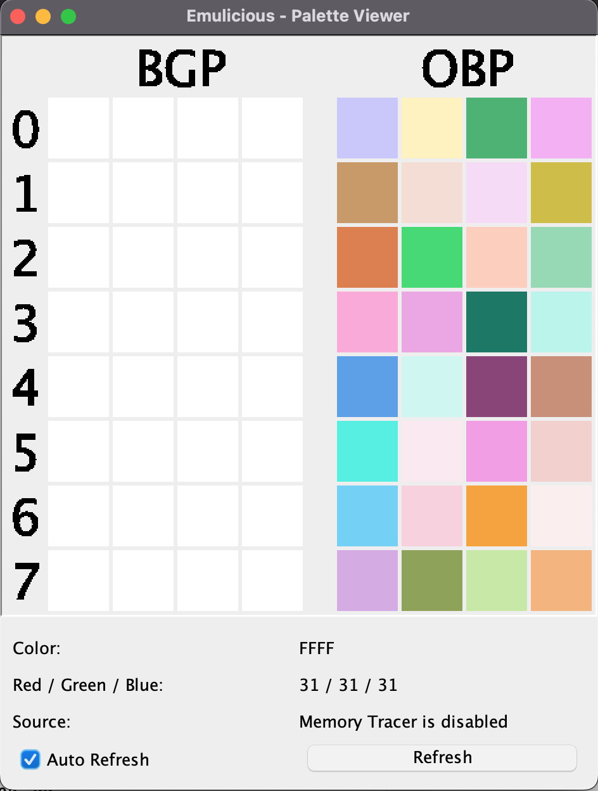

# Lezione 2 - Il Background

## Gestione Background
Dopo aver ripulito la memoria, ci concentriamo sulla gestione del background. è possibile disegnare sullo schermo in due momenti:

* *VBlank* è il momento in cui il Game Boy non sta aggiornando i pixel sullo schermo e si prepara a disegnare il prossimo frame. Durante il VBlank, possiamo modificare la VRAM senza causare problemi visivi.

* *Schermo spento* è possibile spegnere lo schermo inserendo il valore zero nel registro rLCDC, questa operazione può avvenire solo durante un VBlank altrimenti potrebbe danneggiarsi lo schermo. A schermo spento, si possono modificare in sicurezza i valori nella VRAM.

Definiamo la subroutine che ci permette di aspettare un periodo di VBlank

*file: utils/graphics.asm*
```
SECTION "Game graphics", ROM0

  
wait_vblank:         
  .notvblank           ; definita la label notvblank
  ld a, [$ff44]        ; salviamo in a la coordinata y (la linea che 
                       ; sta disegnando al momento il Game Boy)
                       ; 144 - 153 VBlank area
  cp 144               ; Operazione aritmetica a - 144
  jr c, .notvblank     ; Se c’è un carry non siamo in vblank, ripetiamo 
                      ; il ciclo
  ret
```

Dopo aver definito la subroutine per attendere il VBlank, possiamo procedere a disegnare i tile sullo schermo. Prima di tutto, dobbiamo caricarli all'interno della VRAM. Per fare ciò, definiamo una subroutine che si occupa della copia dei dati da una parte all’altra della memoria, facilitando così questa operazione.

---
*file: utils/vram.asm*
```
  ; -- Questa subroutine viene utilizzata per spostare i dati da una parte all'altra della memoria
  ; -- hl: destination
  ; -- de: source
  ; -- bc: map len
  copy_data_to_destination:
  .copy_bin_loop           ; definita la label copy_bin_loop
  ld a, [de]               ; Prendiamo un byte dall’indirizzo contenuto 
                           ; nella coppia di registri de
  ld [hli], a              ; Lo inseriamo nell’indirizzo contenuto dalla 
                           ; coppia di registri hl e incrementiamo hl
  inc de                   ; incrementiamo di uno de cosi puntiamo al 
                           ; prossimo indirizzo
  dec bc                   ; Decrementiamo bc (La quantita di dati da 
                           ; copiare)
  ld a, b
  or c
  jr nz, .copy_bin_loop    ; Cicliamo fin quando bc non diventa zero
  ret
```
---

Aggiungiamo gli include necessari e copiamo le texture dalla ROM alla VRAM

---
*file: main.asm*
```
INCLUDE "utils/vram.asm"
INCLUDE "hardware.inc"
INCLUDE "utils/graphics.asm"
INCLUDE "utils/rom.asm"

SECTION "Header", ROM0[$100]

EntryPoint: 
nop 
jp Start ; Leave this tiny space

SECTION "Game code", ROM0[$150]
Start:
call wait_vblank
xor a                 ;
ld [rLCDC], a         ;  Turn off the LCD by putting zero in the rLCDC register
<operazioni pulizia memoria … >
ld hl, $9040
                                             ; carichiamo il tile della zolla 
                                             ; di terreno nell’indirizzo 
                                             ; $9040 della vram
ld bc, __mud - mud                           ; 
ld de, mud                                   ; Copy mud tile data to vram
call copy_data_to_destination                ; 

ld hl, $9010                                 ;
ld bc, __grass - grass                       ;
ld de, grass                                 ; Copy grass tile data to vram
call copy_data_to_destination                ; 

ld hl, $9020                                 ; 
ld bc, __water_1 - water_1                   ;
ld de, water_1                               ; Copy water tile data to vram
call copy_data_to_destination                ;

ld hl, $9030                                 ;
ld bc, __water_2 - water_2                   ;
ld de, water_2                               ; Copy water2 tile data to vram
call copy_data_to_destination                ;        

ld hl, $9050                                 ;
ld bc, __grass_mud - grass_mud               ;
ld de, grass_mud                             ; Copy grass mud tile data to vram
call copy_data_to_destination                ;
```
---

Tutte le texture necessarie per generare il background citate nel codice precedente devono essere incluse nella ROM.

---
*file: utils/rom.asm*
```
SECTION "textures", ROM0[$031c]
mud:
INCBIN "backgrounds/mud.chr"
__mud:
grass:
INCBIN "backgrounds/grass.chr"
__grass:
grass_mud:
INCBIN "backgrounds/grass_mud.chr"
__grass_mud:
water_1:
INCBIN "backgrounds/water_1.chr"
__water_1:
water_2:
INCBIN "backgrounds/water_2.chr"
__water_2: 
```
---

Una volta completato il processo di copia delle texture, possiamo compilare il nostro codice ed eseguire l'emulatore. Visualizziamo la VRAM per accertarci che i tile siano stati caricati correttamente.

```
# cd /<directory_del_progetto/feli
# ./run_program.<estensione>
# java -jar Emulicius/Emulicius.jar feli.gbc
```

<div align="center">
  
</div>

Ogni tile della VRAM è caratterizzata da un ID, e l’inserimento di quest’ultimo negli indirizzi di memoria di un tile dello schermo consente di riportarne il contenuto. 
Per disegnare una intera mappa, quindi, definiamo una tile map.

---
*file utils/rom.asm*
```
gravity_tile_map:
db $00, $00, $00, $00, $00, $00, $00, $00, $00, $00, $00, $00, $00, $00, $00, $00, $00, $00, $00, $00, 1,1,1,1,1,1,1,1,1,1,1,1
db $00, $00, $00, $00, $00, $00, $00, $00, $00, $06, $06, $00, $00, $00, $00, $00, $06, $00, $00, $00, 1,1,1,1,1,1,1,1,1,1,1,1
db $00, $00, $00, $00, $00, $00, $00, $00, $06, $06, $06, $06, $00, $00, $00, $06, $06, $06, $00, $00, 1,1,1,1,1,1,1,1,1,1,1,1
db $00, $00, $00, $00, $00, $00, $00, $00, $00, $00, $00, $00, $00, $00, $00, $00, $00, $00, $00, $00, 1,1,1,1,1,1,1,1,1,1,1,1
db $00, $00, $06, $00, $00, $00, $05, $05, $05, $05, $05, $05, $05, $05, $00, $00, $00, $00, $00, $00, 1,1,1,1,1,1,1,1,1,1,1,1
db $00, $06, $06, $06, $00, $00, $00, $00, $00, $00, $00, $00, $00, $00, $00, $00, $00, $00, $00, $00, 1,1,1,1,1,1,1,1,1,1,1,1
db $00, $00, $00, $00, $00, $00, $00, $00, $00, $00, $00, $00, $00, $00, $00, $00, $00, $00, $00, $00, 1,1,1,1,1,1,1,1,1,1,1,1
db $05, $05, $05, $05, $05, $05, $00, $00, $00, $00, $00, $00, $00, $00, $05, $05, $05, $05, $05, $05, 1,1,1,1,1,1,1,1,1,1,1,1
db $00, $00, $00, $00, $00, $00, $00, $00, $00, $00, $00, $00, $00, $00, $00, $00, $00, $00, $00, $00, 1,1,1,1,1,1,1,1,1,1,1,1
db $00, $00, $00, $00, $00, $00, $00, $00, $00, $00, $00, $00, $06, $06, $06, $06, $00, $00, $00, $00, 1,1,1,1,1,1,1,1,1,1,1,1
db $00, $00, $00, $00, $00, $05, $05, $05, $05, $05, $05, $05, $05, $05, $05, $06, $06, $00, $00, $00, 1,1,1,1,1,1,1,1,1,1,1,1
db $00, $00, $00, $00, $00, $00, $00, $00, $00, $00, $00, $06, $06, $06, $06, $06, $06, $00, $00, $00, 1,1,1,1,1,1,1,1,1,1,1,1
db $00, $06, $06, $06, $00, $00, $00, $00, $00, $00, $00, $00, $00, $00, $00, $00, $00, $00, $00, $00, 1,1,1,1,1,1,1,1,1,1,1,1
db $05, $05, $05, $06, $06, $00, $00, $00, $00, $00, $00, $00, $00, $00, $00, $00, $00, $05, $05, $05, 1,1,1,1,1,1,1,1,1,1,1,1
db $06, $06, $06, $06, $06, $00, $00, $00, $00, $00, $00, $00, $00, $00, $00, $00, $00, $00, $00, $00, 1,1,1,1,1,1,1,1,1,1,1,1
db $00, $00, $00, $00, $00, $00, $00, $00, $00, $00, $00, $00, $00, $00, $00, $00, $00, $00, $00, $00, 1,1,1,1,1,1,1,1,1,1,1,1
db $01, $01, $01, $01, $01, $01, $01, $02, $02, $02, $02, $02, $01, $01, $01, $01, $01, $01, $01, $01, 1,1,1,1,1,1,1,1,1,1,1,1
db $04, $04, $04, $04, $04, $04, $04, $02, $02, $02, $02, $02, $04, $04, $04, $04, $04, $04, $04, $04, 1,1,1,1,1,1,1,1,1,1,1,1
__gravity_tile_map:

```
---

Copiamo sullo schermo la tilemap con la routine definita in precedenza, inserendo le righe di codice che seguono subito dopo le operazioni di pulizia della memoria

---
*file: main.asm*
```
ld bc, __gravity_tile_map - gravity_tile_map
ld hl, $9800
ld de, gravity_tile_map
call copy_data_to_destination
ld a, %10000011 ;bg will start from 9800  ; Riaccendiamo lo schermo 
ld [rLCDC], a                             ;

```
---

Infine, eseguiamo i seguenti comandi per avviare il gioco

```
# cd /<directory_del_progetto/feli/
# ./run_program.<estensione>
# java -jar Emulicius/Emulicius.jar feli.gbc
```

Output ROM: feli.gbc

<div align="center">
  
</div>

Lo schermo nonostante l'inserimento degli id delle tile presenti nella VRAM è ancora bianco, Questo comportamento è dovuto all'assenza dei colori nelle palette. Ogni Game Boy Color dispone di otto  palette dedicate al background e otto dedicate agli oggetti. Mentre le palette per gli oggetti vengono generate automaticamente, quelle per il background sono inizialmente impostate su colori bianchi

<div align="center">
  
</div>

