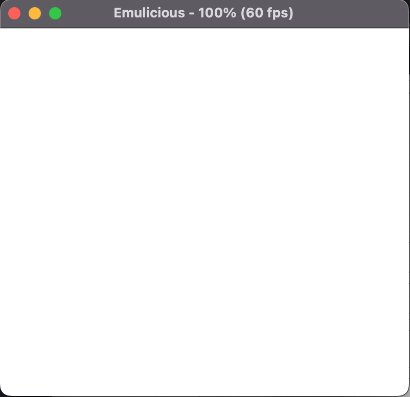

# Lezione 2 - Il Background

## Gestione Background
Dopo aver pulito tutta la memoria ci occupiamo del background. Ci sono due momenti in cui è possibile disegnare sullo schermo:
* *VBlank* è il momento in cui il Game Boy non sta aggiornando i pixel sullo schermo perché si prepara a disegnare il prossimo frame.
* *Schermo spento* è possibile spegnere lo schermo (Questa operazione può essere effettuata solo durante un VBlank oppure si potrebbe danneggiare lo schermo) , aggiornare il suo contenuto per poi riaccenderlo.

Quindi definiamo la subroutine che ci permette di aspettare un periodo di VBlank

*file: utils/graphics.asm*
```
SECTION "Game graphics", ROM0

  
wait_vblank:         
  .notvblank           ; definita la label notvblank
  ld a, [$ff44]        ; salviamo in a la coordinata y (la linea che 
                       ; sta disegnando al momento il Game Boy)
                       ; 144 - 153 VBlank area
  cp 144               ; Operazione aritmetica a - 144
  jr c, .notvblank     ; Se c’è un carry non siamo in vblank, ripetiamo 
                      ; il ciclo
  ret
```

Per disegnare i tile sullo schermo, dobbiamo prima caricarli all'interno della VRAM, definiamo quindi la subroutine che si occupa della copia dei dati da una parte all’altra della memoria per poter effettuare questa operazione


*file: utils/vram.asm*

```
  ; -- !!!Disable screen - ppu before calling this method!!!
  ; -- this subroutine is used to copy data from source to destination
  ; -- hl: destination
  ; -- de: source
  ; -- bc: map len
  copy_data_to_destination:
  .copy_bin_loop           ; definita la label copy_bin_loop
  ld a, [de]               ; Prendiamo un byte dall’indirizzo contenuto 
                           ; nella coppia di registri de
  ld [hli], a              ; Lo inseriamo nell’indirizzo contenuto dalla 
                          ; coppia di registri hl e incrementiamo hl
  inc de                   ; incrementiamo di uno de cosi puntiamo al 
                           ; prossimo indirizzo
  dec bc                   ; Decrementiamo bc (La quantita di dati da 
                           ; copiare)
  ld a, b
  or c
  jr nz, .copy_bin_loop    ; Cicliamo fin quando bc non diventa zero
  ret
```

aggiungiamo gli include necessari e copiamo le texture dalla rom alla vram

*file: main.asm*
```
INCLUDE "utils/vram.asm"
INCLUDE "hardware.inc"
INCLUDE "utils/graphics.asm"
INCLUDE "utils/rom.asm"

<operazioni pulizia memoria … >

call wait_vblank
xor a                 ;
ld [rLCDC], a         ;  spegnamo l' LCD inserendo zero nel registro rLCDC
                                             ; di terreno nell’indirizzo 
                                             ; $9040 della vram
ld bc, __mud - mud                           ; 
ld de, mud                                   ; Copy mud tile data to vram
call copy_data_to_destination                ; 

ld hl, $9010                                 ;
ld bc, __grass - grass                       ;
ld de, grass                                 ; Copy grass tile data to vram
call copy_data_to_destination                ; 

ld hl, $9020                                 ; 
ld bc, __water_1 - water_1                   ;
ld de, water_1                               ; Copy water tile data to vram
call copy_data_to_destination                ;

ld hl, $9030                                 ;
ld bc, __water_2 - water_2                   ;
ld de, water_2                               ; Copy water2 tile data to vram
call copy_data_to_destination                ;        

ld hl, $9050                                 ;
ld bc, __grass_mud - grass_mud               ;
ld de, grass_mud                             ; Copy grass mud tile data to vram
call copy_data_to_destination                ;
```

Tutte le texture necessarie per generare il background citate nel codice precedente vanno incluse nella ROM

*file: utils/rom.asm*
```
SECTION "textures", ROM0
mud:
INCBIN "backgrounds/mud.chr"
__mud:
grass:
INCBIN "backgrounds/grass.chr"
__grass:
grass_mud:
INCBIN "backgrounds/grass_mud.chr"
__grass_mud:
water_1:
INCBIN "backgrounds/water_1.chr"
__water_1:
water_2:
INCBIN "backgrounds/water_2.chr"
__water_2: 
```

se compiliamo ed inseriamo la rom all'interno dell'emulatore, visualizzando la VRAM potremo vedere che tutti i tile son stati correttamente caricati
```
# cd /<directory_del_progetto/feli
# ./run_program.<estensione>
```


Ogni tile della VRAM è caratterizzata da un ID e l’inserimento di quest’ultimo negli indirizzi di memoria di un tile dello schermo consente di riportarne il contenuto. 
Per poter riportare una intera mappa quindi, definiamo una tile map.

*file utils/rom.asm*
```
gravity_tile_map:
db $00, $00, $00, $00, $00, $00, $00, $00, $00, $00, $00, $00, $00, $00, $00, $00, $00, $00, $00, $00, 1,1,1,1,1,1,1,1,1,1,1,1
db $00, $00, $00, $00, $00, $00, $00, $00, $00, $06, $06, $00, $00, $00, $00, $00, $06, $00, $00, $00, 1,1,1,1,1,1,1,1,1,1,1,1
db $00, $00, $00, $00, $00, $00, $00, $00, $06, $06, $06, $06, $00, $00, $00, $06, $06, $06, $00, $00, 1,1,1,1,1,1,1,1,1,1,1,1
db $00, $00, $00, $00, $00, $00, $00, $00, $00, $00, $00, $00, $00, $00, $00, $00, $00, $00, $00, $00, 1,1,1,1,1,1,1,1,1,1,1,1
db $00, $00, $06, $00, $00, $00, $05, $05, $05, $05, $05, $05, $05, $05, $00, $00, $00, $00, $00, $00, 1,1,1,1,1,1,1,1,1,1,1,1
db $00, $06, $06, $06, $00, $00, $00, $00, $00, $00, $00, $00, $00, $00, $00, $00, $00, $00, $00, $00, 1,1,1,1,1,1,1,1,1,1,1,1
db $00, $00, $00, $00, $00, $00, $00, $00, $00, $00, $00, $00, $00, $00, $00, $00, $00, $00, $00, $00, 1,1,1,1,1,1,1,1,1,1,1,1
db $05, $05, $05, $05, $05, $05, $00, $00, $00, $00, $00, $00, $00, $00, $05, $05, $05, $05, $05, $05, 1,1,1,1,1,1,1,1,1,1,1,1
db $00, $00, $00, $00, $00, $00, $00, $00, $00, $00, $00, $00, $00, $00, $00, $00, $00, $00, $00, $00, 1,1,1,1,1,1,1,1,1,1,1,1
db $00, $00, $00, $00, $00, $00, $00, $00, $00, $00, $00, $00, $06, $06, $06, $06, $00, $00, $00, $00, 1,1,1,1,1,1,1,1,1,1,1,1
db $00, $00, $00, $00, $00, $05, $05, $05, $05, $05, $05, $05, $05, $05, $05, $06, $06, $00, $00, $00, 1,1,1,1,1,1,1,1,1,1,1,1
db $00, $00, $00, $00, $00, $00, $00, $00, $00, $00, $00, $06, $06, $06, $06, $06, $06, $00, $00, $00, 1,1,1,1,1,1,1,1,1,1,1,1
db $00, $06, $06, $06, $00, $00, $00, $00, $00, $00, $00, $00, $00, $00, $00, $00, $00, $00, $00, $00, 1,1,1,1,1,1,1,1,1,1,1,1
db $05, $05, $05, $06, $06, $00, $00, $00, $00, $00, $00, $00, $00, $00, $00, $00, $00, $05, $05, $05, 1,1,1,1,1,1,1,1,1,1,1,1
db $06, $06, $06, $06, $06, $00, $00, $00, $00, $00, $00, $00, $00, $00, $00, $00, $00, $00, $00, $00, 1,1,1,1,1,1,1,1,1,1,1,1
db $00, $00, $00, $00, $00, $00, $00, $00, $00, $00, $00, $00, $00, $00, $00, $00, $00, $00, $00, $00, 1,1,1,1,1,1,1,1,1,1,1,1
db $01, $01, $01, $01, $01, $01, $01, $02, $02, $02, $02, $02, $01, $01, $01, $01, $01, $01, $01, $01, 1,1,1,1,1,1,1,1,1,1,1,1
db $04, $04, $04, $04, $04, $04, $04, $02, $02, $02, $02, $02, $04, $04, $04, $04, $04, $04, $04, $04, 1,1,1,1,1,1,1,1,1,1,1,1
__gravity_tile_map:

```

Copiamo sullo schermo la tilemap con la routine definita in precedenza, inserendo le righe di codice che seguono subito dopo le operazioni di pulizia della memoria

*file: main.asm*
```
ld bc, __gravity_tile_map - gravity_tile_map
ld hl, $9800
ld de, gravity_tile_map
call copy_data_to_destination
ld a, %10000011 ;bg will start from 9800  ; Riaccendiamo lo schermo 
ld [rLCDC], a                             ;

```

Infine, compiliamo il codice e carichiamo la rom

```
cd /<directory_del_progetto/feli/
./run_program.<estensione>
```

Output ROM: feli.gbc


Lo schermo nonostante l'inserimento degli id delle tile presenti nella VRAM è ancora bianco, ed è tutto corretto.
La ragione per cui non riusciamo a vedere il disegno risiede nell'assenza dei colori nelle palette: 
ogni Game Boy Color ha 8 palette dedicate al background e otto dedicate agli oggetti e, mentre per gli oggetti vengono generate automaticamente, quelle per il background sono inizialmente bianche


