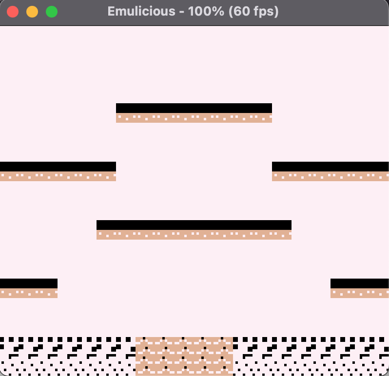
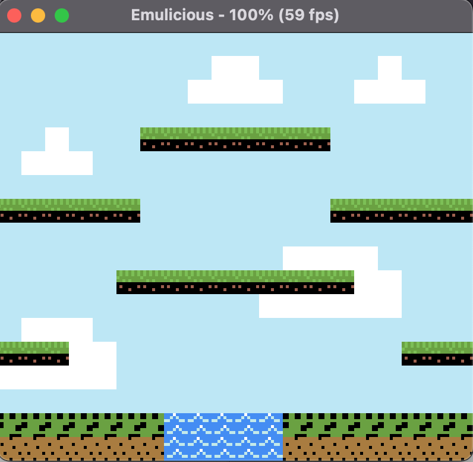

# Lezione 3 Assegnazione colori

## Palettes
Al momento tutte quante le tile hanno come colore assegnato il bianco, è necessario quindi assegnare dei colori alle palette del background per poterle visualizzare correttamente.
Inseriamo il codice che segue prima dell'operazione di accensione dello schermo

*file: main.asm*
```
ld a, %10000000                              ;
ld hl, palettes                              ; Assegnazione palette di colori
ld bc, __palettes - palettes                 ;
call set_palettes_bg                         ;
```

La subroutine set_palettes_bg la definiamo in un nuovo file che chiameremo palettes.asm

*file: utils/palettes.asm*
```
SECTION "Palettes code", ROM0

set_palettes_bg:
ld [$ff68], a                       ; inseriamo %10000000 in $ff68, questo 
                                    ; significa che popoliamo a partire dalla 
                                    ; palette 0 e che ad ogni colore  
                                    ; inserito incrementiamo di 1 
                                    ; l’indirizzamento andando a popolare il            
                                    ; prossimo colore della palette
.palette_loop
ld a, [hli]                         ; Carico l’indirizzo della prima palette 
ld [$ff69], a                       ; inserisco il colore in $ff69
dec bc
ld a, c
or b
jr nz, .palette_loop                ; ripeto il ciclo fino a quando non 
                                    ; abbiamo inserito tutti i colori
ret

```

Andiamo a definire ora nella rom i valori delle palettes. ogni due byte definiscono uno dei quattro colori della palette

*file: utils/rom.asm*
```
palettes:
  db $bf, $66, $f7, $29, $00, $00, $00, $00   ; The color selection for the map
  db $87, $8e, $21, $11, $00, $00, $00, $00   ; 
  db $8f, $8d, $ee, $94, $00, $00, $00, $00   ; 
  db $0f, $df, $43, $78, $ff, $ff, $ff, $ff   ; 
  db $43, $78, $0f, $df, $43, $78, $43, $78   ; 
  db $EE, $94, $00, $00, $87, $8E, $28, $13
  db $ff, $ff, $ff, $ff, $00, $00, $00, $00   ; 
  db $ae, $6e, $ae, $6e, $00, $00, $00, $00   ; 
__palettes:
```

e includiamo nel file main il file delle palette

*file main.asm*
```
INCLUDE "utils/palettes.asm"
```

Arrivati a questo punto compilando la rom possiamo vedere che i colori son presenti, ma assegnati in maniera errata

{style="display: block; margin: auto;" width=150 height=150}


Per assegnare i colori corretti ad ognuna delle tile presenti sullo schermo bisogna inserire nella bank uno dell'indirizzo desiderato un byte, a seconda del valore asssunto da quest ultimo le tile assumeranno diversi attributi.
Se per esempio volessimo assegnare al tile in alto a sinistra (Indirizzo $9800) la palette di colori uno, dovremmo inserire nella parte bassa del byte degli attributi il valore uno.
Il Game Boy color ha due bank, una utilizzata per salvare l'id del tile e l'altra per assegnarvi gli attributi.

eseguiamo quindi le seguenti operazioni
* inseriamo il valore uno nel registro rVBK (Bank uno selezionata)
* Inseriamo nell'indirizzo $9800 il seguente byte %00000001 (Gli ultimi tre bit ci permettono di selezionare BG Palette da 0 a 7)

Per assegnare a tutti i tile del nostro schermo gli attributi è stata definita la subroutine background_assign_attributes, che invochiamo nel file main

*file: main.asm*
```
call background_assign_attributes                                 
```

e definiamo all’interno del file graphics


*file: utils/graphics.asm*
```
background_assign_attributes:
    ; Il background puo iniziare da $9800 o $9c00 a seconda del valore inserito nel registro rLCDC
    ld a, [rLCDC]              ; Spostiamo il valore di rLCDC in a
    ld b, a                         ; Lo salviamo in b
    ld a, [LCDCF_BG9C00]          ; carichiamo LCDCF_BG9C00 in a 
    cp a, b                                     ; effettuiamo una sottrazione
    jr z, .bg_start_from_9c00   ; se il valore è zero lo sfondo in utilizzo è $9c00
    .bg_start_from_9800          ; Altrimenti il valore è $9800
    ld de, $9800                          ;
    jp .__bg_start_from            ;
    .bg_start_from_9c00          ;
    ld de, $9c00                          ;
    .__bg_start_from                ;
    ; 0 is the first idx
    ; 3ff is the last idx
    ld hl, $1
    .bg_tile_loop
    ld a, %00000000          ; settiamo la vram bank 0 (Quella dove sono conservati i tiles)
    ld [rVBK], a                   ;
    ld a, [de]                       ; 

    cp a, $0                        ; se l’id dell’indirizzo di memoria corrente è zero
    jr z, .sky_tile               ; allora questo è un tile del cielo, saltiamo alla parte di codice che se          
                                         ; ne occupa
    cp a, $4                      ; l’id 4 rappresenta una zolla di fango
    jr z, .mud_tile           ; saltiamo alla parte di codice che se ne occupa

    cp a, $1                     ; l’id 4 rappresenta una zolla di fango
    jr z, .grass_tile         ; saltiamo alla parte di codice che se ne occupa

    cp a, $2                     ; l’id 4 rappresenta una zolla di fango
    jr z, .water_tile        ; saltiamo alla parte di codice che se ne occupa

    cp a, $3                     ; l’id 4 rappresenta una zolla di fango
    jr z, .water_tile        ; saltiamo alla parte di codice che se ne occupa

    cp a, $5                       ; l’id 4 rappresenta una zolla di fango
    jr z, .grass_mud_tile ; saltiamo alla parte di codice che se ne occupa

    cp a, $6                    ; l’id 4 rappresenta una zolla di fango
    jr z, .cloud_tile        ; saltiamo alla parte di codice che se ne occupa

    .grass_tile
    ld a, %00000001          ; seleziono il bank 1 (Quello destinato agli attributi)
    ld [rVBK], a                   ; inserendo 1 nel registro rVBK
    ld a, %00000001         ; inseriamo in a il valore 1 (Palette 1)
    ld [de], a                       ; lo assegniamo all’indirizzo corrente
    jp .assigned
    .grass_mud_tile
    ld a, %00000001          ; seleziono il bank 1 (Quello destinato agli attributi)
    ld [rVBK], a                    ; inserendo 1 nel registro rVBK
    ld a, %00000101         ; inseriamo in a il valore 5 (Palette 5)
    ld [de], a
    jp .assigned
    .mud_tile
    ld a, %00000001     ; seleziono il bank 1 (Quello destinato agli attributi)
    ld [rVBK], a              ;  inserendo 1 nel registro rVBK
    ld a, %00000010    ; inseriamo in a il valore 2 (Palette 2)
    ld [de], a
    jp .assigned
    .water_tile
    ld a, %00000001       ; seleziono il bank 1 (Quello destinato agli attributi)
    ld [rVBK], a                 ; inserendo 1 nel registro rVBK
    ld a, %10000011       ; inseriamo la palette 3 per l’acqua e il valore 1 in alto sta ad indicare la priorità: Se il personaggio passera in questa tile passera da dietro
    ld [de], a
    jp .assigned
    .cloud_tile
    ld a, %00000001   ; seleziono il bank 1 (Quello destinato agli attributi)
    ld [rVBK], a              ; inserendo 1 nel registro rVBK
    ld a, %00000110   ; inseriamo la palette 6 per le nuvole
    ld [de], a
    jp .assigned
    .sky_tile
    ld a, %00000001    ; seleziono il bank 1 (Quello destinato agli attributi)
    ld [rVBK], a              ; inserendo 1 nel registro rVBK
    ld a, %00000111    ; inseriamo la palette 7 per il cielo
    ld [de], a
    .assigned
    ld a, %00000001          ; seleziono il bank 1 (Quello destinato agli attributi)
    ld [rVBK], a                 ; inserendo 1 nel registro rVBK
    inc de
    inc hl
    ld a, $3                         ;
    cp a, h                          ;
    jr nz, .bg_tile_loop    ;  Continuiamo il ciclo fino a quando non avremo
    ld a, $ff                        ; assegnato un attributo ad ogni tile del bg
    cp a, l                           ;
    jr nz, .bg_tile_loop    ;

    xor a                    ; resettiamo la vram bank a zero
    ld [rVBK], a         ;
    ret
```

Infine, compiliamo il codice e carichiamo la rom

```
# cd /<directory_del_progetto/feli/
# ./run_program.<estensione>
```

<div style="display: flex; justify-content: center;">
  
</div>
{style="display: block; margin: auto;" width=150 height=150}

