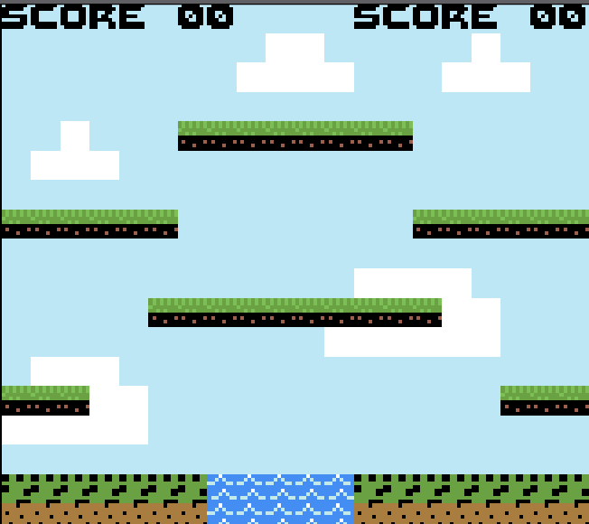

## Lezione - 4 Score Labels
Lo scopo del gioco sarà quello di competere con la CPU per ottenere quanti piu punti possibili. Per tener conto del punteggio di ogni giocatore creeremo delle label apposite. Prima di tutto, per poter scrivere sullo schermo del Game Boy dobbiamo caricare in memoria i caratteri che andremo a disegnare sullo schermo.
Includiamo nella ROM il file binario che li contiene

---
*file utils/rom.asm*
```
char_bin:
	; Questa è l’unica volta in cui useremo questa sintassi, dice al compilatore di prendere soltanto I primi 1024 byte, questo lo facciamo perche nel file usato come input ci sono caratteri che non andiamo ad utilizzare che riempirebbero inutilmente la vram
 	INCBIN "backgrounds/char", 0,1024          ; The tiles that will be loaded into the vram
__char_bin:
```
---

Copiamo dalla ROM alla VRAM i byte del file di input inserendo il codice che segue nel file main, prima del main loop, per poi invocare la subroutine *create_score_labels* che definiremo nel file graphics

---
*file main.asm*
```
    ld hl, $9300                                 ;
    ld bc, __char_bin - char_bin                 ;
    ld de, char_bin                              ; Copy characters to vram
    call copy_data_to_destination                ;
    call create_score_labels
```
---
*file: utils/graphics.asm*
```
create_score_labels:
    ld hl, $9800
    ld de, S_
    ld a, [de]
    ld [hli], a
    ld de, C_
    ld a, [de]
    ld [hli], a
    ld de, O_
    ld a, [de]
    ld [hli], a
    ld de, R_
    ld a, [de]
    ld [hli], a
    ld de, E_
    ld a, [de]
    ld [hli], a
    inc hl
    ld de, _0
    ld a, [de]
    ld [hli], a
    ld de, _0
    ld a, [de]
    ld [hli], a

    inc hl
    inc hl
    inc hl
    inc hl

    ld de, S_
    ld a, [de]
    ld [hli], a
    ld de, C_
    ld a, [de]
    ld [hli], a
    ld de, O_
    ld a, [de]
    ld [hli], a
    ld de, R_
    ld a, [de]
    ld [hli], a
    ld de, E_
    ld a, [de]
    ld [hli], a
    inc hl
    ld de, _0
    ld a, [de]
    ld [hli], a
    ld de, _0
    ld a, [de]
    ld [hli], a
    ret
 ```
---

Nella precedente subroutine ci sono delle lettere come per esempio *S_* che rappresentano l’indice nella VRAM dei vari caratteri appena caricati in memoria, tutte queste costanti le definiamo nella ROM

---
*file: utils/rom.asm
```
A_: db $51
B_: db $52
C_: db $53
D_: db $54
E_: db $55
F_: db $56
G_: db $57
H_: db $58
I_: db $59
J_: db $5A
K_: db $5B
L_: db $5C
M_: db $5D
N_: db $5E
O_: db $5F
P_: db $60
Q_: db $61
R_: db $62
S_: db $63
T_: db $64
U_: db $65
V_: db $66
X_: db $67
Y_: db $68
_0: db $40
_1: db $41
_2: db $42
_3: db $43
_4: db $44
_5: db $45
_6: db $46
_7: db $47
_8: db $48
_9: db $49
```
---

Gli indici che salviamo nella ROM sono questi perché abbiamo deciso di salvare *char_bin* nella VRAM a partire dall’indirizzo di memoria $9300. Una modifica alla posizione di copia richiederebbe un cambio di tutti quanti questi indici oppure ci sarebbero inconsistenze o glitch grafici quando si prova a disegnare sullo schermo.

Compiliamo ed eseguiamo il codice
```
# cd /<directory_del_progetto/feli/
# ./run_program.<estensione>
# java -jar Emulicius/Emulicius.jar feli.gbc
```

Output ROM: feli.gbc
<div align="center">
  
</div>
